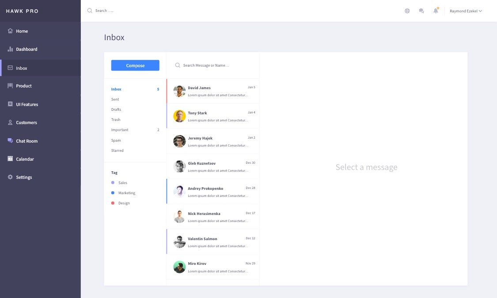

Admin story

it begins on the same login page as the student-user. Once the admin-user enters their login info they're asked to provide secondary verification.

[adminstory](iPhone_X-XS-11_Pro–1.png)

if user is unable to provide authentication they will be shown a screen that details
that their login info was incorrect and to retry the session.

Once the correct info was entered and verified the admin-user home page appears.
this is where the admin-user has access to the dashboard which allows navigation to the other pages. The admin user goes to the "student" page, not "customers". This is where the admin user has access to viewing who is in their selected class.

Within the roster page the admin-user can have certain interactions with the students on the roster
  ie: communicate
      view attendance record

From the roster page, the admin-user can go to the communication page by clicking a student and selecting "message" or something to that effect

after returning to the dashboard the admin-user has the option of viewing the calendar to create/edit tasks due for students or for calendar events related to the instructor

returning to the dashboard again the admin-user has the option of checking attendance for their class.
